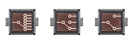
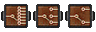

# Barotrauma Mod: Router Component

[Steam Workshop Link](https://steamcommunity.com/sharedfiles/filedetails/?id=2904379228)

This mod ads a new `ItemComponent` for mapping input signals to it's matching
output in the channels the component is currently on  to the game as well
as one implementations of each of the three possible configurations of that
`ItemComponent`.


## Item Info

In the SubEditor, the items can be found under the `Electrical` tab. They are
visually similar to the builtin `Relay Component`.
Which channel signals are routed to is controlled by an integer value stored on
the component. This value can be set in the SubEditor or in-game through its UI, or via one of
the three control inputs. The current value can be read electrically from its
control output.


### Inventory Icon




### Game Sprite




### Wiring Panel

Legend:

- `\_`&`_/`: continuos signal
- `\:`&`:/`: non-`0` pulse
- `\*`&`*/`: variable signal

```PlainText
Control Signals
\*set_state         state_out_/
\:prev_state                  |
\:next_state                  |
```

```PlainText
Router Component (2 Channels)
\*set_state         state_out_/
\:prev_state    signal_out_0A*/
\:next_state    signal_out_1A*/
\*signal_in_0   signal_out_2A*/
\*signal_in_1   signal_out_0B*/
\*signal_in_2   signal_out_1B*/
|               signal_out_2B*/
```

```PlainText
Router Component (3 Channels)
\*set_state         state_out_/
\:prev_state    signal_out_0A*/
\:next_state    signal_out_1A*/
\*signal_in_0   signal_out_0B*/
\*signal_in_1   signal_out_1B*/
|                signal_out_0C*/
|                signal_out_1C*/
```

```PlainText
Router Component (6 Channels)
\*set_state         state_out_/
\:prev_state     signal_out_A*/
\:next_state     signal_out_B*/
\*signal_in      signal_out_C*/
|                signal_out_D*/
|                signal_out_E*/
|                signal_out_F*/
```


## `ItemComponent` Info

The `ItemComponent` can be implenented via the XML element `RouterComponent`,
the layout of iputs and output signals is defined with the `layout` attribute.
`RouterComponent` inherits from the builtin `ItemComponent`, and so will
accept [any of its attributes][ic link] as well. Examples of its implementation
can be found in the [files] of this mod.


```XML
<!-- layout   in,ch -->
<!-- `Single`=> 1x6 -->
<!-- `Double`=> 2x3 -->
<!-- `Triple`=> 3x2 -->
<!-- if omitted will default to Double -->
<RouterComponent layout="Single" canbeselected="true" vulnerabletoemp="false" />
```

The `RouterComponent` will check wether inputs and outputs of any one grouping
are either all present or all absent. It will not test for the presence of any
of its control inputs. What this means in practice is that things like the
following are valid `ConnectionPanel` configuration.

```PlainText
<RouterComponent layout="Triple">
\*set_state         <omitted> |
| <omitted>     signal_out_0A*/
| <omitted>     signal_out_1A*/
\*signal_in_0       <omitted> |
\*signal_in_1   signal_out_0B*/
| <omitted>     signal_out_1B*/
|                   <omitted> |
```

**NOTE:** Actual signal names which the code looks for don't match how they
are displayed in-game for the items this mod implements or the names used in the
above panel representations. I considered fixing changing the code, but it
doesn't seem like it would be worth the effort. This way the code generating
the grouping dict can stay nice and simple, and it's just as easy to read in
XML definitions.

> sg -> signal index (zero based)  
> ch -> channel index (zero based)

| Layout   | Input Names   | Output  Input Names |
|----------|---------------|---------------------|
| `Single` | signal_in     | signal_out[ch]      |
| `Double` | signal_in[sg] | signal_out[ch]_[sg] |
| `Triple` | signal_in[sg] | signal_out[ch]_[sg] |

[ic link]:<https://regalis11.github.io/BaroModDoc/ItemComponents/ItemComponent.html>
[files]:<./Items/routercomponent.xml>


## Licensing

Any usage of this package or substancial portions of the packahe in connection
with Barotrauma or accompanying material offered by Undertow Games is subject to
their End User License Agreement. Certain aspects of this package such as
maintenance tools may be licensed under MIT or an equivalent license. For
details, look for explicit license declaration at the top of files, consult the
[license] document contained within the package, or contact the package
maintainers.

[license]:<./LICENSE>
